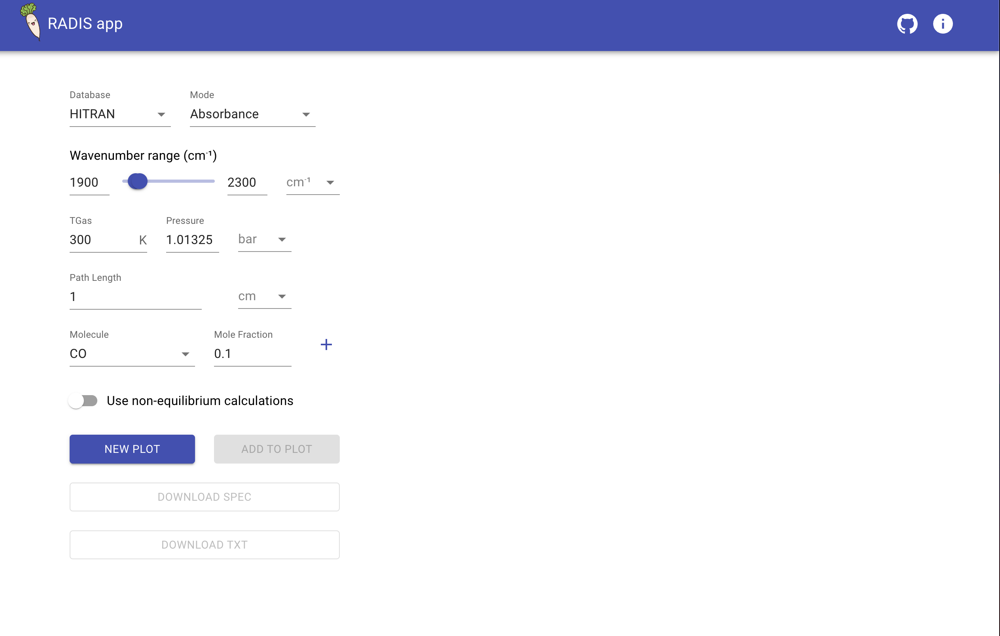

# Unit Selection
Previously radis only supports the fixed arbitary units [cm-1(wavelength range) , bar(pressure) ..] , but now user can chose the units from the interface what they are want to use.
*  **PULL** >> https://github.com/suzil/radis-app/pull/645

  

 

# Bugs Fixes
After integrating the unit selection features we have some bugs in the radis app . Basically their is another feature that is integrated by @suzil [overlay spectra], so it is creating some conflicts in the radis app. So we have to fix those bugs.
*  **PULL** >>
        (unit_selection)[https://github.com/suzil/radis-app/pull/645]
        (download button bug)[https://github.com/suzil/radis-app/pull/661]

# Documentation
Taking about docs radis app providing the old docs when we are preety much using the lamda in backend . But more scalability we moved to **FastApi** . So we have to update the docs for the new backend and frontend stuff also .
*  **PULL** >>
          (README Update)[https://github.com/suzil/radis-app/pull/670]
