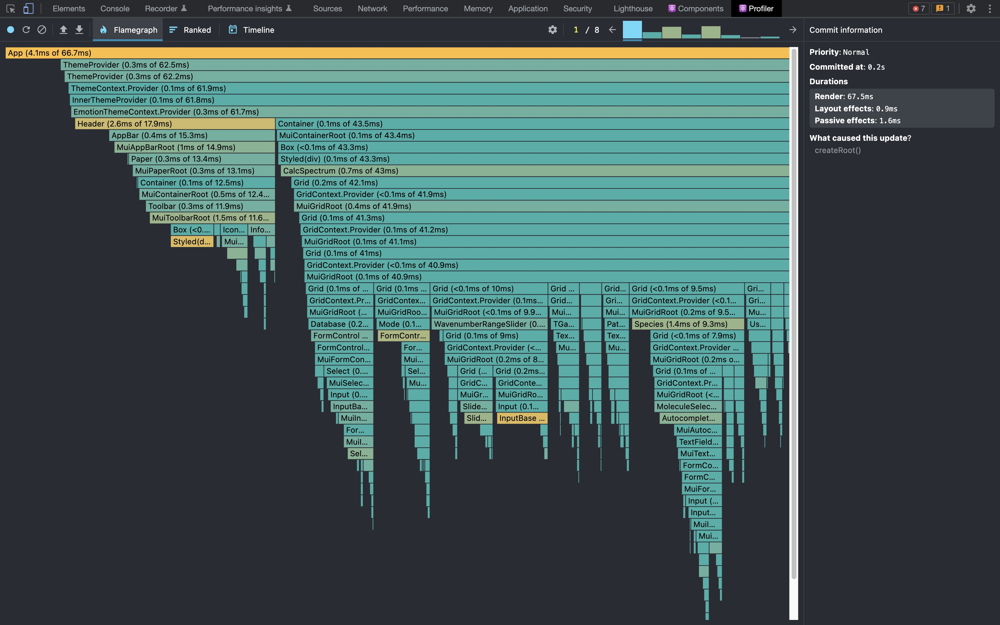
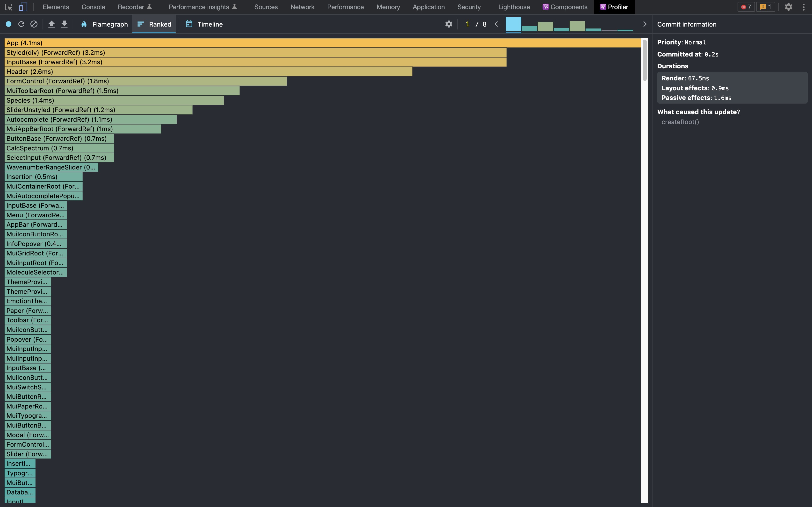
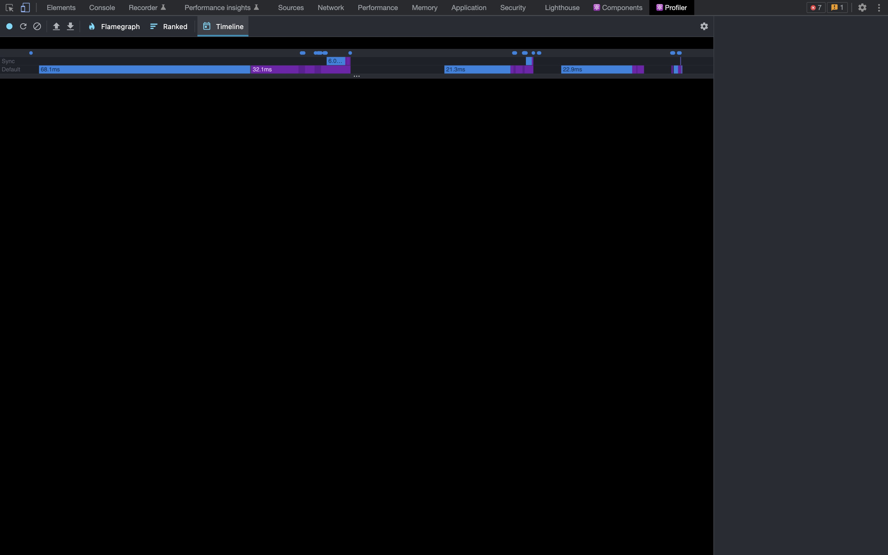
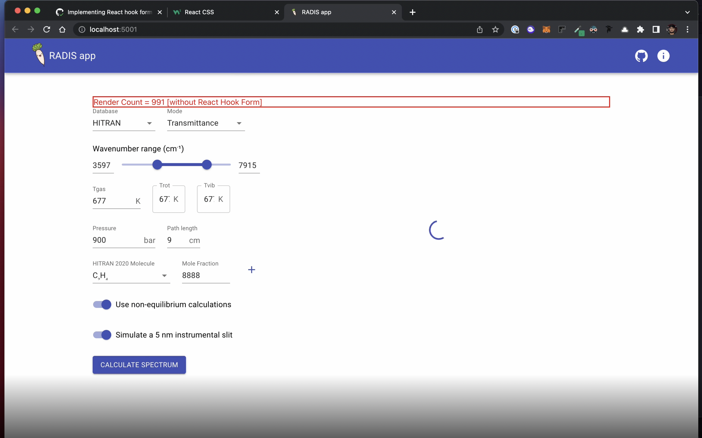

Radis app uses `useState` to populate data and maintain state; while this works well for small scale applications, as it becomes better over time, handling errors and state changes will become more challenging. As a result, we decided to include **React hook form**.

## Profiling Data

#### > Flamegraph

  

#### > Rankgraph

  

#### > Timeline Graph

  

#### > Render Count

  

### Approches to fix this 
According to the statistics, the Radis app requires several unnecessary re-renders. I was considering fixing this the traditional method by using
`React Memo`, but after discussing with mentors, we chose to utilise `React Hook
Form` instead (because the Radis app is a type of form).

Thanks .