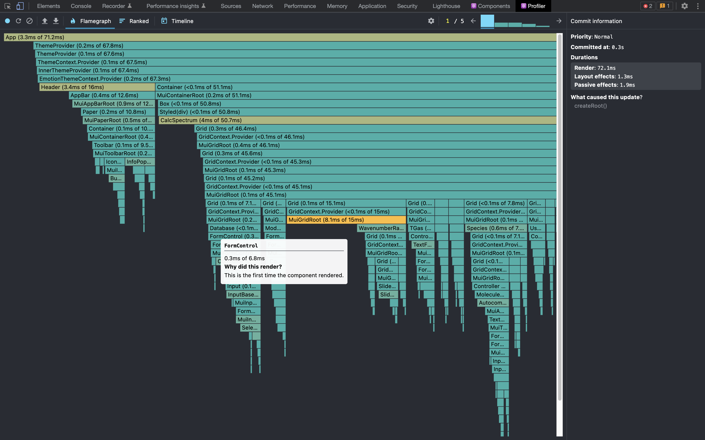
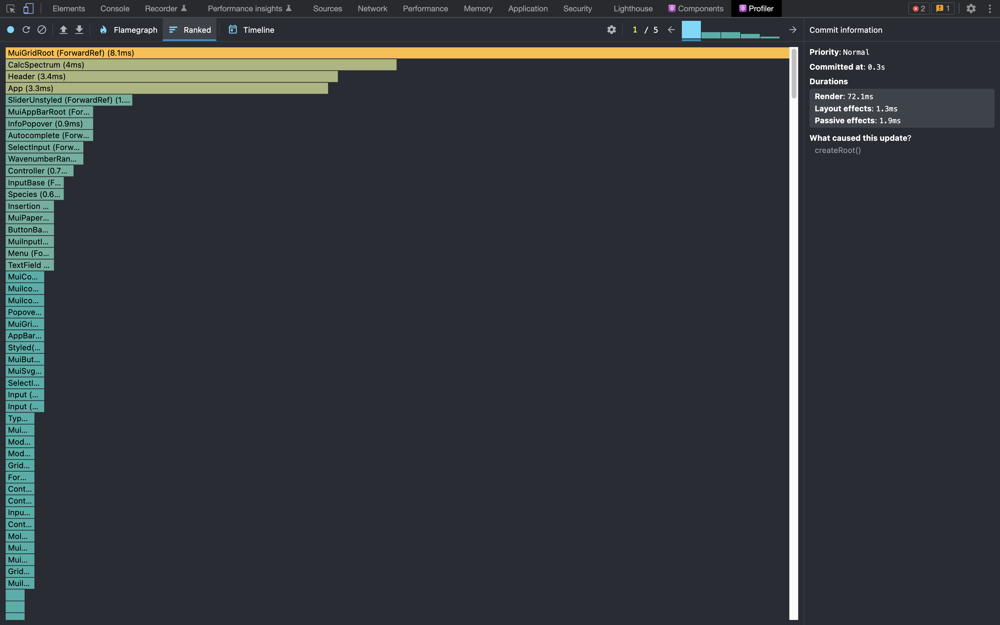
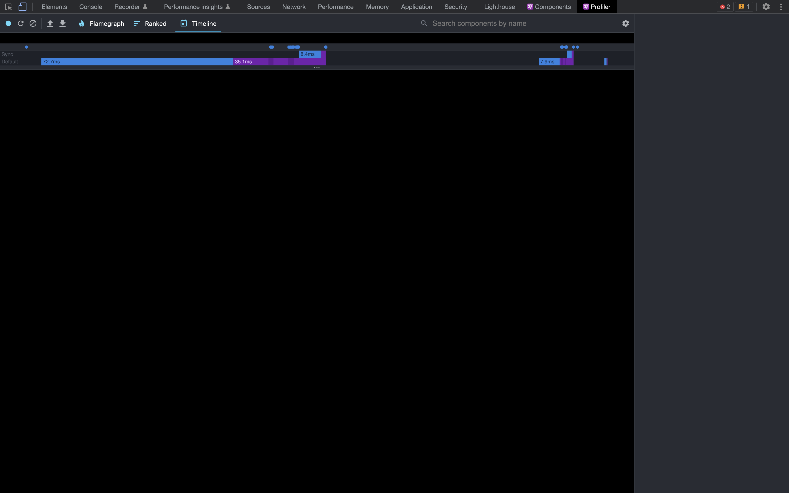
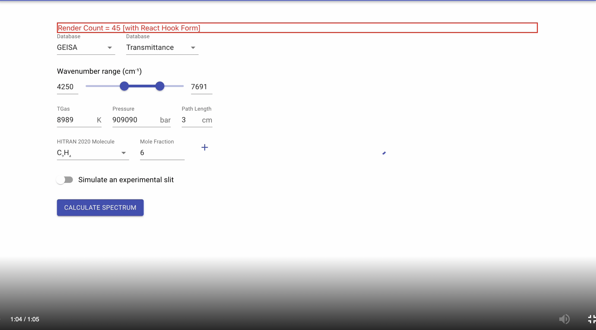

After analyzing the the benchmarks and taking with my mentors , we are decided to go with `React Hook Form` for it’s performace , low package size etc ..

Their is many ways to integrate  React Hook form in the app , using `useFormContext` (easy way no need pass `props`)and  using `Controller`  . After analylizing both ways i decied to go with `Controller` because `useFormContext` has some performance issues . For validation we use `yup` to validate the fields.

```tsx
//demo.tsx
import {useForm,controller} form "react-hook-form";
//types of input
type FormValues = {
name:string
age:number
address?:string
}
//validation
const validationSchema = yup.object({
  name: yup.string().required("Required"),
  age: yup.number().required("Required")
  address: yup.string().required("Required")
});
//destructure the **useForm**
const { register, handleSubmit } = useForm<FormVales>({});
//submit function
const onSubmit = async data<FormValues> => { console.log(data); };
//controller conponent
<Controller
  control={control}
  name="test"
  render={({
    field: { onChange, onBlur, value, name, ref },
    fieldState: { invalid, isTouched, isDirty, error },
    formState,
  }) => (
    <Checkbox
      onBlur={onBlur} // notify when input is touched
      onChange={onChange} // send value to hook form
      checked={value}
      inputRef={ref}
    />
  )}
/>
//submmit button
<button type = "submit"> submit </button>
//DS: this code is not actual , it is just for understanding , actual code more complicated
```

## Profiling data

#### Flamegraph

<p>
  
</p>

#### Rankgraph

<p>
  
</p>

#### Timelinegraph

<p>
  
</p>

#### Render count

<p>
  
</p>

#### Referance : 

> **[https://react-hook-form.com/](https://react-hook-form.com/)**

> **[https://blog.logrocket.com/react-hook-form-vs-formik-comparison/#:~:text=Technical comparison of React Hook Form and Formik&text=Based on the minzipped size,the difference in open issues](https://blog.logrocket.com/react-hook-form-vs-formik-comparison/#:~:text=Technical%20comparison%20of%20React%20Hook%20Form%20and%20Formik&text=Based%20on%20the%20minzipped%20size,the%20difference%20in%20open%20issues)**.

Thanks .