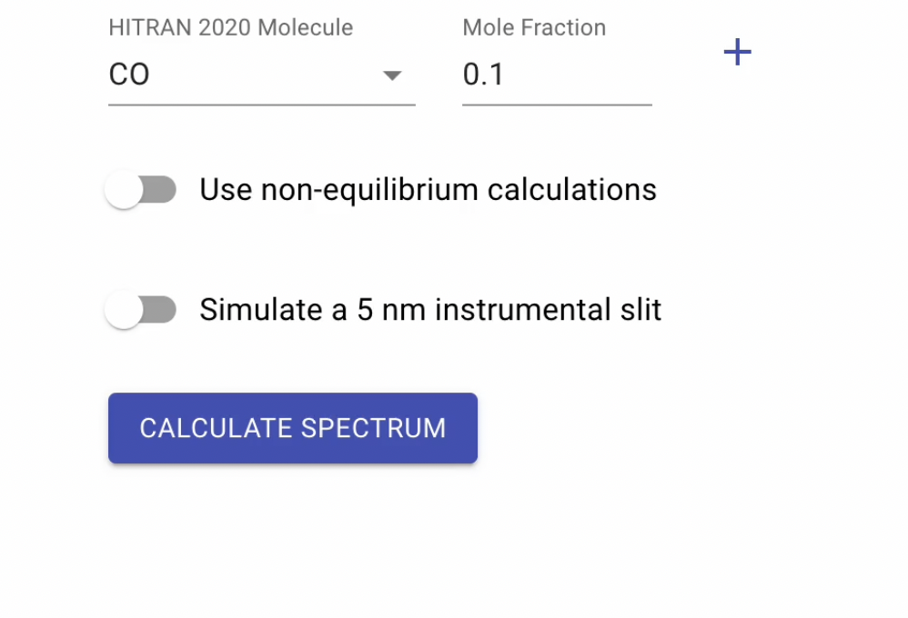
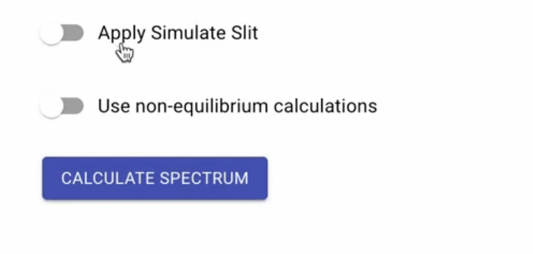
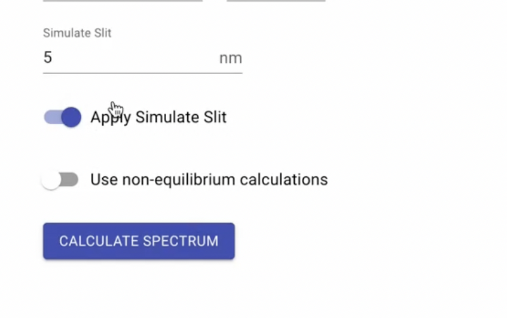

## Impove default resolution of ploted spectrum
In `wstep = “auto”` radis app gives slitly low res. for that reasons plotted `spectrum` is slitly in low res.  for that we just need to update the config .
```python
import radis
radis.config["GRIDPOINTS_PER_LINEWIDTH_WARN_THRESHOLD"] = 7
```
## Simulate Slit
There is a pre-configured `slit of 5 nm` that users can only apply in the previous version of the Radis app, which prevents users from applying the slit they desire.
## Older Version :

<p>
  
</p>

## Newer Version :
However, in the more recent version, the issues have been resolved, and now users merely need to flip the `Apply Simulate Slit` option in order to apply a slit.
```tsx
//calspectrum.tsx
const UseSimulateSlit = () => (
    <Controller
      name="useSimulateSlit"
      control={control}
      render={() => (
        <FormControlLabel
          label="Apply Simulate Slit"
          control={
            <Switch
              checked={useSlit}
              onChange={(e) => {
                setUseSlit(e.target.checked);
                if (e.target.checked) {
                  setValue("simulate_slit", 5);
                } else {
                  setValue("simulate_slit", undefined);
                }
              }}
            />
          }
        />
      )}
    />
  );
   //validation
   simulate_slit: yup
      .number()
      .typeError("Simulate slit must be defined")
      .min(0, "Simulate slit must be positive")
      .max(30, "Simulate slit must be less than 30")
      .when("useSlitSwitch", {
        is: true,
        then: yup
          .number()
          .typeError("Simulate slit must be defined")
          .min(0, "Simulate slit must be positive")
          .max(30, "Simulate slit must be less than 30"),
      }),
```
<p>
  
</p>
The option popups users may apply the slit that they want `(Slit value must me <30 nm`  && in `absorbance` It is unavailable.)
<p>
  
</p>
DS : it has some bugs we are working on to intrgrate .

Thanks .