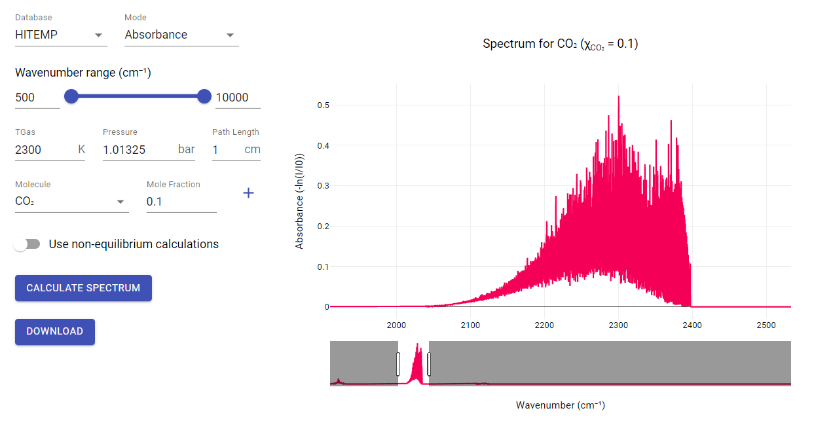

# hitemap integration

Previously radis app is supported two databanks to load the spectrum . Now we are implemented `hitemap`
on the interface , the databank is really big , but we are sucessfully implemented it on the interface .

* samples with the CO2 Spectrum, 500 - 10,000 cm-1, computed from HITEMP at high temperature (2300 K)  :
  it calculated million of lines within few minutes !!

  

 

